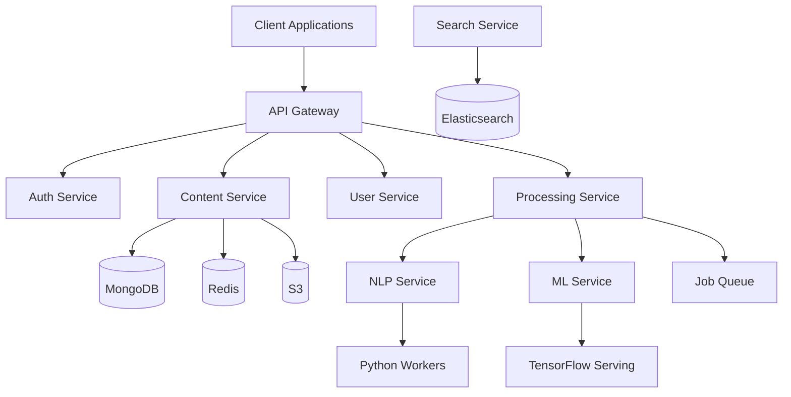
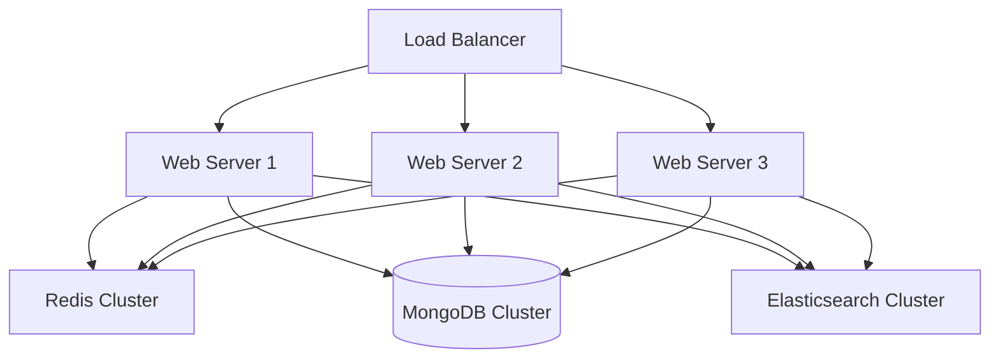

# Learning Atomizer Architecture Documentation

## System Architecture

### Overview
Learning Atomizer is a distributed system designed for scalable content processing and delivery. The architecture follows microservices principles with event-driven communication.

### Core Components

1. **Frontend Layer**
   - Vue.js SPA
   - Progressive Web App
   - Real-time updates
   - Offline support

2. **API Layer**
   - Express.js REST API
   - GraphQL API
   - WebSocket server
   - API Gateway

3. **Processing Layer**
   - Content atomization
   - NLP processing
   - ML inference
   - Background jobs

4. **Data Layer**
   - MongoDB (primary storage)
   - Redis (caching)
   - Elasticsearch (search)
   - S3 (file storage)

### System Design

## Component Details

### 1. Frontend Architecture
- **Framework**: Vue.js 3
- **State Management**: Vuex
- **Routing**: Vue Router
- **UI Components**: Custom design system
- **Build Tool**: Vite
- **Testing**: Jest + Vue Test Utils

### 2. Backend Architecture
- **Framework**: Express.js
- **API Styles**: REST + GraphQL
- **Real-time**: Socket.io
- **Authentication**: JWT + OAuth2
- **Validation**: Joi
- **Testing**: Jest + Supertest

### 3. Processing Architecture
- **NLP Engine**: spaCy + NLTK
- **ML Framework**: TensorFlow
- **Queue System**: Bull
- **Task Scheduler**: node-cron
- **Processing Pipeline**: Custom workflow engine

### 4. Data Architecture
- **Primary Database**: MongoDB
- **Cache Layer**: Redis
- **Search Engine**: Elasticsearch
- **File Storage**: AWS S3
- **Data Backup**: AWS Glacier

## Infrastructure

### Production Environment

### Deployment Architecture
- **Container Platform**: Kubernetes
- **Service Mesh**: Istio
- **Registry**: Amazon ECR
- **CI/CD**: GitHub Actions
- **Monitoring**: Prometheus + Grafana
- **Logging**: EFK Stack

## Security Architecture

### Authentication & Authorization
1. **User Authentication**
   - JWT tokens
   - OAuth2 providers
   - MFA support
   - Session management

2. **API Security**
   - API keys
   - Rate limiting
   - Request validation
   - CORS policies

3. **Data Security**
   - Encryption at rest
   - TLS in transit
   - Key management
   - Data masking

### Network Security
1. **Infrastructure**
   - VPC configuration
   - Security groups
   - Network policies
   - WAF rules

2. **Application**
   - DDoS protection
   - Input validation
   - XSS prevention
   - CSRF protection

## Scalability

### Horizontal Scaling
1. **Application Layer**
   - Auto-scaling groups
   - Load balancing
   - Session affinity
   - Health checks

2. **Database Layer**
   - Sharding
   - Replication
   - Read replicas
   - Connection pooling

### Performance Optimization
1. **Caching Strategy**
   - Multi-level caching
   - Cache invalidation
   - Cache warming
   - Cache synchronization

2. **Content Delivery**
   - CDN integration
   - Asset optimization
   - Compression
   - Lazy loading

## Monitoring & Observability

### Metrics Collection
1. **System Metrics**
   - CPU usage
   - Memory usage
   - Disk I/O
   - Network traffic

2. **Application Metrics**
   - Request rates
   - Error rates
   - Response times
   - Queue lengths

### Logging
1. **Log Management**
   - Centralized logging
   - Log rotation
   - Log analysis
   - Alert triggers

2. **Audit Trail**
   - User actions
   - System changes
   - Security events
   - Compliance logs

## Disaster Recovery

### Backup Strategy
1. **Data Backups**
   - Full backups
   - Incremental backups
   - Point-in-time recovery
   - Cross-region replication

2. **System Recovery**
   - Recovery procedures
   - Failover testing
   - Backup validation
   - Recovery time objectives

## Development Workflow

### Version Control
1. **Git Strategy**
   - Feature branches
   - Pull requests
   - Code review
   - Version tagging

2. **Release Management**
   - Release planning
   - Version control
   - Changelog maintenance
   - Rollback procedures

### Testing Strategy
1. **Test Types**
   - Unit tests
   - Integration tests
   - E2E tests
   - Performance tests

2. **Test Automation**
   - CI/CD pipeline
   - Test coverage
   - Automated QA
   - Security scanning

## Future Considerations

### Planned Improvements
1. **Technical Debt**
   - Code refactoring
   - Performance optimization
   - Security hardening
   - Documentation updates

2. **New Features**
   - AI enhancements
   - Mobile applications
   - API expansion
   - Integration options

### Technology Roadmap
1. **Short Term**
   - Performance optimization
   - Security improvements
   - Feature enhancements
   - Bug fixes

2. **Long Term**
   - Architecture evolution
   - Platform expansion
   - Technology upgrades
   - Scale improvements
