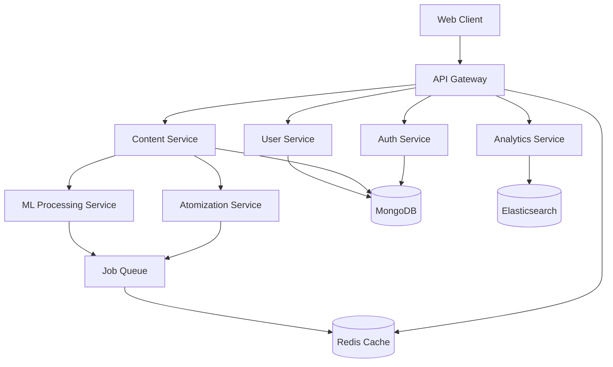

# Technical Architecture PRD - Learning Atomizor

## 1. Technical Overview

### 1.1 Architecture Philosophy
- **Microservices Architecture**: Loosely coupled, independently deployable services
- **Event-Driven Design**: Asynchronous communication between services
- **API-First Approach**: All functionality exposed through well-defined APIs
- **Cloud-Native**: Designed for containerization and cloud deployment

### 1.2 Technology Stack

#### Backend Services
- **Runtime**: Node.js 18+ with Express.js framework
- **Database**: MongoDB 6.0+ for primary data storage
- **Cache**: Redis 7.0+ for session management and caching
- **Search**: Elasticsearch 8.0+ for content search and analytics
- **Message Queue**: Redis Pub/Sub for event handling
- **ML/AI**: Python 3.9+ with TensorFlow/PyTorch for content processing

#### Frontend Application
- **Framework**: Vue.js 3.x with Composition API
- **State Management**: Pinia for centralized state
- **UI Library**: PrimeVue for component library
- **Build Tool**: Vite for fast development and building
- **Testing**: Vitest for unit testing, Cypress for E2E

#### Infrastructure & DevOps
- **Containerization**: Docker with multi-stage builds
- **Orchestration**: Kubernetes for container management
- **CI/CD**: GitHub Actions for automated deployment
- **Monitoring**: Prometheus + Grafana for metrics
- **Logging**: ELK Stack (Elasticsearch, Logstash, Kibana)

## 2. System Architecture

### 2.1 Service Architecture



### 2.2 Core Services

#### 2.2.1 API Gateway Service
**Purpose**: Central entry point for all client requests
**Responsibilities**:
- Request routing and load balancing
- Authentication and authorization
- Rate limiting and throttling
- Request/response transformation
- API versioning management

**Technology**: Node.js + Express + express-gateway
**Scaling**: Horizontal scaling with load balancer

#### 2.2.2 Authentication Service
**Purpose**: User authentication and authorization management
**Responsibilities**:
- User registration and login
- JWT token generation and validation
- Role-based access control (RBAC)
- Session management
- Password reset and security features

**Technology**: Node.js + Express + JWT + bcrypt
**Database**: MongoDB (users, roles, permissions)
**Cache**: Redis (sessions, tokens)

#### 2.2.3 Content Management Service
**Purpose**: Content storage, retrieval, and metadata management
**Responsibilities**:
- Content upload and storage
- File processing and validation
- Metadata extraction and indexing
- Content versioning and history
- Access control and permissions

**Technology**: Node.js + Express + Multer + Sharp
**Database**: MongoDB (content metadata)
**Storage**: AWS S3 or compatible object storage
**Search**: Elasticsearch (content indexing)

#### 2.2.4 Atomization Service
**Purpose**: Core content atomization and processing
**Responsibilities**:
- Content parsing and analysis
- Text segmentation and chunking
- Learning objective extraction
- Dependency mapping
- Quality scoring and validation

**Technology**: Python + FastAPI + spaCy + NLTK
**Queue**: Redis for background processing
**ML Models**: Custom NLP models + pre-trained transformers

#### 2.2.5 User Management Service
**Purpose**: User profile and preference management
**Responsibilities**:
- User profile management
- Learning preferences and settings
- Progress tracking and history
- Achievement and badge system
- Social features and connections

**Technology**: Node.js + Express + Mongoose
**Database**: MongoDB (user profiles, preferences)

#### 2.2.6 Analytics Service
**Purpose**: Data collection, processing, and reporting
**Responsibilities**:
- Event tracking and collection
- Real-time analytics processing
- Report generation and dashboards
- Learning insights and recommendations
- Performance metrics and KPIs

**Technology**: Node.js + Express + Elasticsearch
**Database**: Elasticsearch (events, metrics)
**Visualization**: Grafana dashboards

## 3. Data Architecture

### 3.1 Database Design

#### MongoDB Collections

##### Users Collection
```javascript
{
  _id: ObjectId,
  email: String,
  password: String, // hashed
  profile: {
    firstName: String,
    lastName: String,
    avatar: String,
    preferences: Object
  },
  roles: [String],
  createdAt: Date,
  updatedAt: Date,
  lastLogin: Date
}
```

##### Content Collection
```javascript
{
  _id: ObjectId,
  title: String,
  description: String,
  type: String, // 'document', 'video', 'audio'
  originalFile: {
    filename: String,
    mimetype: String,
    size: Number,
    url: String
  },
  metadata: {
    author: String,
    subject: String,
    difficulty: String,
    duration: Number,
    language: String
  },
  status: String, // 'uploaded', 'processing', 'completed', 'failed'
  atomization: {
    totalAtoms: Number,
    completedAt: Date,
    version: String
  },
  owner: ObjectId,
  createdAt: Date,
  updatedAt: Date
}
```

##### Learning Atoms Collection
```javascript
{
  _id: ObjectId,
  contentId: ObjectId,
  sequence: Number,
  title: String,
  content: String,
  type: String, // 'text', 'image', 'video', 'quiz'
  metadata: {
    concepts: [String],
    difficulty: Number,
    estimatedTime: Number,
    prerequisites: [ObjectId]
  },
  relationships: {
    dependencies: [ObjectId],
    related: [ObjectId]
  },
  createdAt: Date,
  updatedAt: Date
}
```

### 3.2 Caching Strategy

#### Redis Cache Layers
- **Session Cache**: User sessions and authentication tokens (TTL: 24h)
- **Content Cache**: Frequently accessed content metadata (TTL: 1h)
- **API Response Cache**: Common API responses (TTL: 15min)
- **Processing Queue**: Background job queue for atomization

### 3.3 Search and Indexing

#### Elasticsearch Indices
- **Content Index**: Full-text search across all content
- **Atom Index**: Searchable learning atoms with metadata
- **Analytics Index**: Event data for reporting and insights

## 4. Security Architecture

### 4.1 Authentication & Authorization
- **JWT Tokens**: Stateless authentication with refresh tokens
- **RBAC**: Role-based access control with granular permissions
- **API Keys**: Service-to-service authentication
- **OAuth 2.0**: Third-party integration support

### 4.2 Data Security
- **Encryption at Rest**: AES-256 encryption for sensitive data
- **Encryption in Transit**: TLS 1.3 for all communications
- **Input Validation**: Comprehensive validation and sanitization
- **SQL Injection Prevention**: Parameterized queries and ORM usage

### 4.3 Infrastructure Security
- **Network Security**: VPC with private subnets
- **Container Security**: Distroless images and security scanning
- **Secrets Management**: Kubernetes secrets and external secret stores
- **Audit Logging**: Comprehensive audit trail for all operations

## 5. Performance Requirements

### 5.1 Response Time Targets
- **API Endpoints**: <200ms for 95th percentile
- **Content Upload**: <5s for files up to 100MB
- **Atomization Processing**: <30s per document
- **Search Queries**: <100ms for most queries

### 5.2 Throughput Requirements
- **Concurrent Users**: 10,000+ simultaneous users
- **API Requests**: 10,000+ requests per minute
- **Content Processing**: 1,000+ documents per hour
- **Data Storage**: 10TB+ content storage capacity

### 5.3 Scalability Design
- **Horizontal Scaling**: All services designed for horizontal scaling
- **Auto-scaling**: Kubernetes HPA based on CPU/memory metrics
- **Database Scaling**: MongoDB replica sets and sharding
- **CDN Integration**: Global content delivery for static assets

## 6. Monitoring and Observability

### 6.1 Application Monitoring
- **Health Checks**: Kubernetes liveness and readiness probes
- **Metrics Collection**: Prometheus metrics for all services
- **Distributed Tracing**: Jaeger for request tracing
- **Error Tracking**: Sentry for error monitoring and alerting

### 6.2 Infrastructure Monitoring
- **Resource Monitoring**: CPU, memory, disk, network metrics
- **Container Monitoring**: Docker and Kubernetes metrics
- **Database Monitoring**: MongoDB and Redis performance metrics
- **Network Monitoring**: Service mesh observability

### 6.3 Alerting Strategy
- **Critical Alerts**: Service downtime, high error rates
- **Warning Alerts**: Performance degradation, resource limits
- **Info Alerts**: Deployment notifications, maintenance windows

## 7. Deployment Architecture

### 7.1 Environment Strategy
- **Development**: Local Docker Compose setup
- **Staging**: Kubernetes cluster mirroring production
- **Production**: Multi-zone Kubernetes deployment
- **DR**: Cross-region disaster recovery setup

### 7.2 CI/CD Pipeline
```yaml
stages:
  - lint: Code quality and style checks
  - test: Unit and integration tests
  - build: Docker image building
  - security: Security scanning and validation
  - deploy: Automated deployment to environments
  - verify: Post-deployment verification
```

### 7.3 Rollback Strategy
- **Blue-Green Deployment**: Zero-downtime deployments
- **Canary Releases**: Gradual rollout with monitoring
- **Automatic Rollback**: Triggered by health check failures
- **Database Migrations**: Backward-compatible schema changes

## 8. Development Standards

### 8.1 Code Quality
- **Linting**: ESLint for JavaScript, Black for Python
- **Testing**: 80%+ code coverage requirement
- **Documentation**: JSDoc for JavaScript, Sphinx for Python
- **Type Safety**: TypeScript adoption for critical services

### 8.2 API Standards
- **REST API**: RESTful design with proper HTTP methods
- **GraphQL**: For complex queries and real-time subscriptions
- **OpenAPI**: Comprehensive API documentation
- **Versioning**: Semantic versioning with backward compatibility

### 8.3 Database Standards
- **Schema Design**: Normalized design with performance considerations
- **Indexing**: Strategic indexing for query optimization
- **Migrations**: Version-controlled schema migrations
- **Backup**: Automated daily backups with point-in-time recovery

This technical architecture provides a solid foundation for building a scalable, maintainable, and secure Learning Atomizor platform that can grow from MVP to enterprise-scale deployment.
